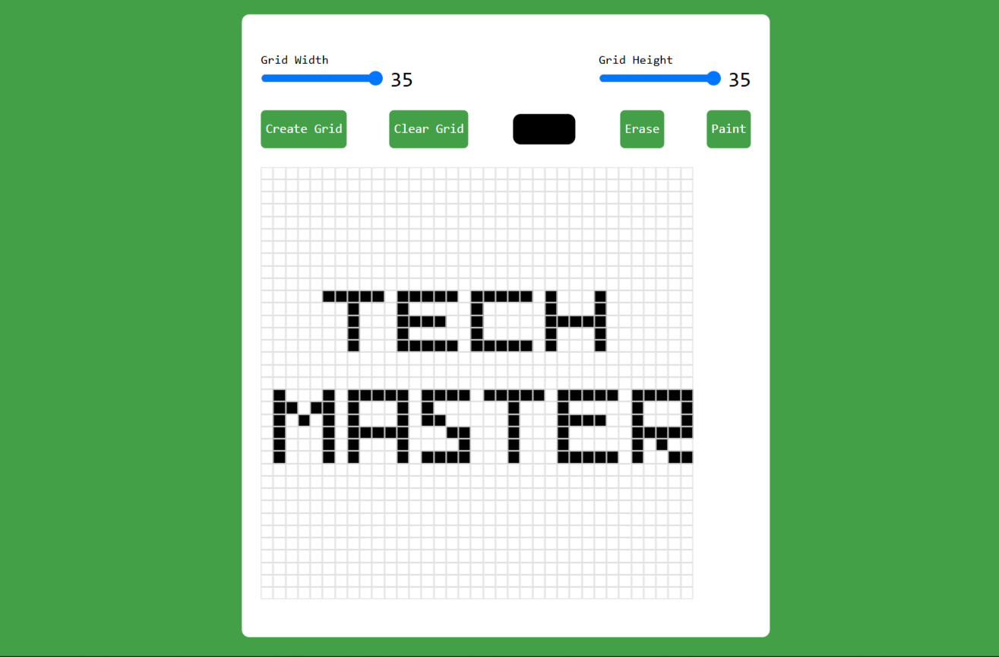

# Pixel Art Generator

This project is a simple pixel art generator created using HTML, CSS, and JavaScript. It allows users to create a grid of customizable size and draw on it using different colors. Users can also switch between paint and erase modes to modify their artwork.

## Features

- Create a grid with customizable width and height.
- Select a color to draw on the grid.
- Switch between paint and erase modes.
- Clear the entire grid with a single click.
- Supports both mouse and touch events for drawing.

## How to Use

1. Adjust the grid width and height using the sliders.
2. Click the "Create Grid" button to generate the grid.
3. Select a color using the color input.
4. Click and drag on the grid to draw with the selected color.
5. Use the "Erase" button to switch to erase mode and remove colors from the grid.
6. Use the "Paint" button to switch back to paint mode.
7. Click the "Clear Grid" button to clear the entire grid.

## Screenshot

## Project Structure

## Technologies Used

- HTML
- CSS
- JavaScript
