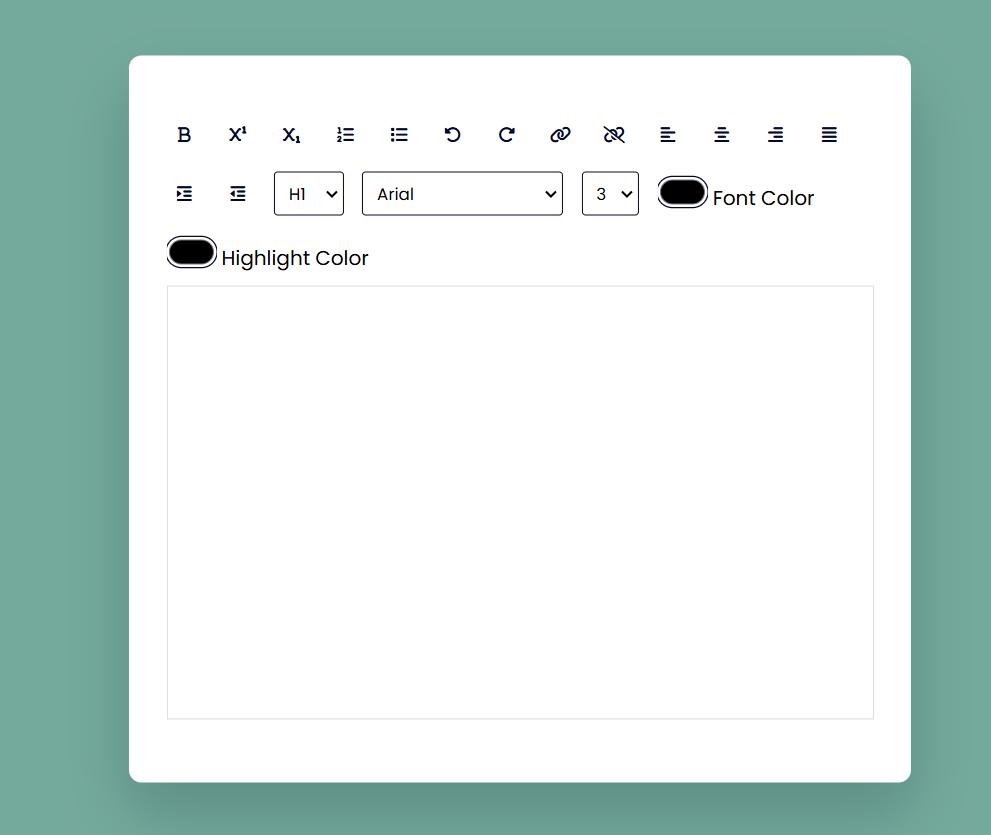

# Text Editor

This is a simple online text editor built with HTML, CSS, and JavaScript. It provides various formatting options to style your text.

## Features

- Bold
- Superscript
- Subscript
- Ordered List
- Unordered List
- Undo
- Redo
- Create Link
- Unlink
- Align Left
- Align Center
- Align Right
- Justify
- Indent
- Outdent
- Heading (H1 to H6)
- Font Name
- Font Size
- Font Color
- Highlight Color

## Usage

1. Clone the repository or download the files.
2. Open `index.html` in your web browser.
3. Use the buttons and options to format your text.

## Files

- `index.html`: The main HTML file containing the structure of the text editor.
- `styles.css`: The CSS file for styling the text editor.
- `script.js`: The JavaScript file for adding functionality to the text editor.

## Dependencies

- [Font Awesome](https://cdnjs.cloudflare.com/ajax/libs/font-awesome/6.2.1/css/all.min.css): For the icons used in the buttons.

## Screenshot

