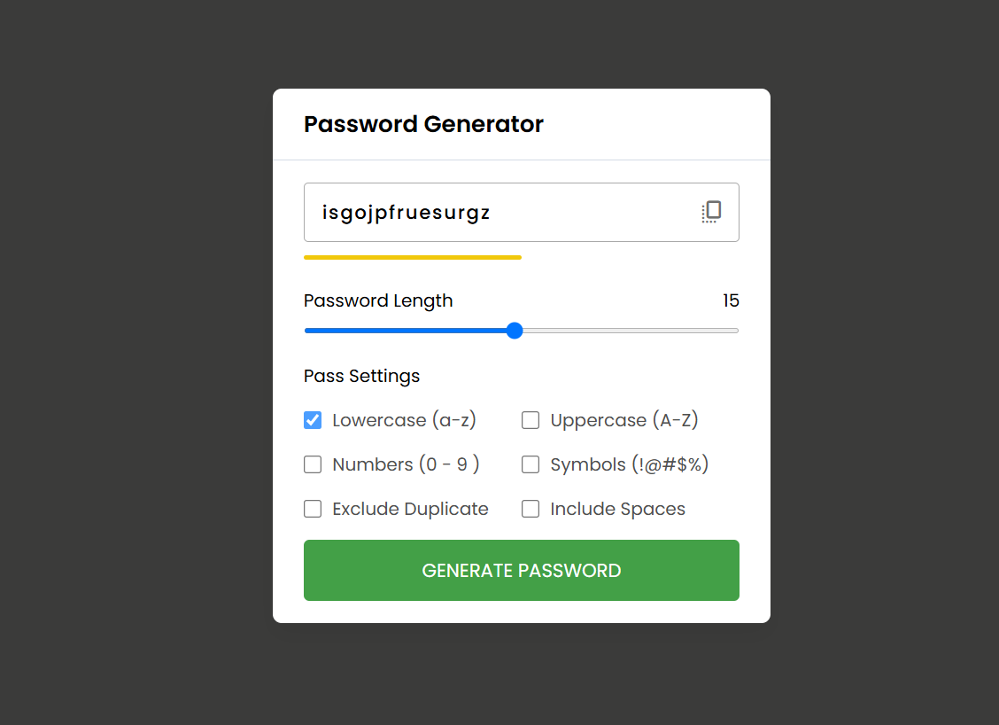

# Password Generator

Welcome to the Password Generator Project.On Day 03 we are focusing on designing the Password Generator .It is the part of "100-days-of-javascript" challenge.

## Table of Contents

- [Introduction](#introduction)
- [Features](#features)
- [Installation](#installation)
- [Usage](#usage)
- [Technologies Used](#technologies-used)

## Introduction

The Password Generator is a simple web application that allows users to generate a random password using the instruction or the options give in the user-interface.

## Features

- The user can select the password length with the help of the slider.
- The user need to select the checkboxes which includes the Lowercase, Uppercase , Symbols , Include spaces and exclude duplicates.
- The user-interface updates whenever the user try to create medium or weak or strong password. If the user try to generate a password which is weaker, then the color bar under the password will be red color.
- Similarly , when the user get's a medium password it shows the orange color so that the user can able to choose different options to get the strong password.
- When the user selects the options which generates the strong password the indicator will be green.

## Installation

To run this project locally, follow these steps:

1. Clone the repository:

   ```bash
   git clone https://github.com/yourusername/100-days-of-javascipt.git
   ```

2. Navigate to the project directory:

   ```bash
   cd 100-days-of-javascript/Day\ 03\ -\ Pass\ Generator
   ```
   ```

3. Open `index.html` in your preferred web browser.

## Usage

1. Select the password lenght using the slider.
2. Tick the checkbox in which you want to include the lowercase letters and uppercase letter to increase the password strength .
3. Based on the options you have chosen the password strength will be displayed so if the password is strong you can copy the password with the help of the copy icon.

## Technologies Used

- HTML
- CSS
- JavaScript

## Screenshot


