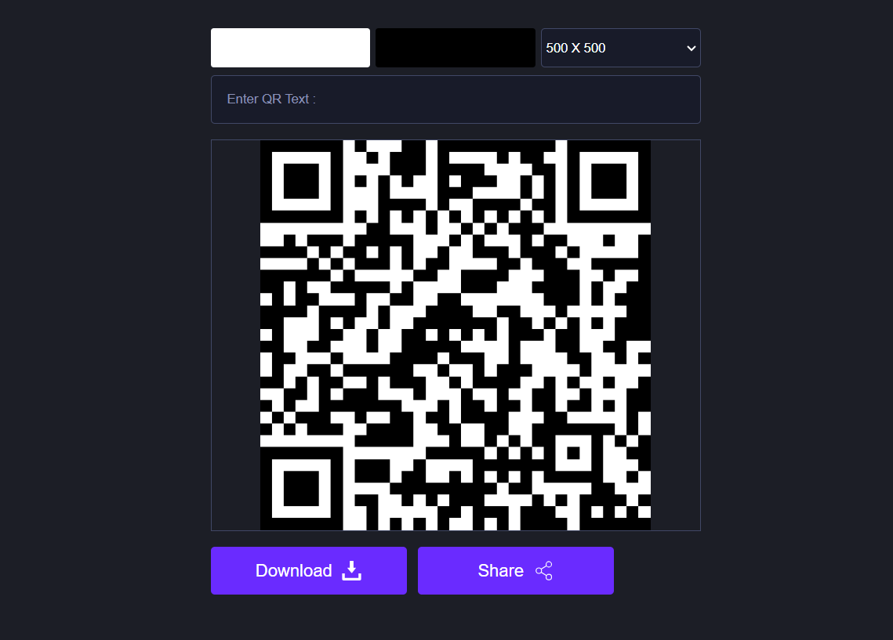

# Day 04 - QR Code Generator

## Project Overview

This project is part of the "100 Days of JavaScript" challenge. On Day 04, we focus on creating a QR Code Generator using JavaScript.

## Features

- Generate QR codes from user input
- Download the generated QR code as an image
- Responsive design for different screen sizes

## Technologies Used

- HTML
- CSS
- JavaScript

## How to Use

1. Clone the repository:
   ```bash
   git clone https://github.com/yourusername/100-days-of-javascript.git
   ```
2. Navigate to the project directory:
   ```bash
   cd 100-days-of-javascript/Day\ 04\ -\ QR\ Code\ Generator
   ```
3. Open `index.html` in your web browser.

## Project Structure

```
/Day 04 - QR Code Generator
│
├── index.html
├── style.css
└── script.js
```

## Acknowledgements

- Inspired by the "100 Days of JavaScript" challenge.
- QR code generation library: [QRCode.js](https://cdnjs.cloudflare.com/ajax/libs/qrcodejs/1.0.0/qrcode.min.js)

## Screenshot


