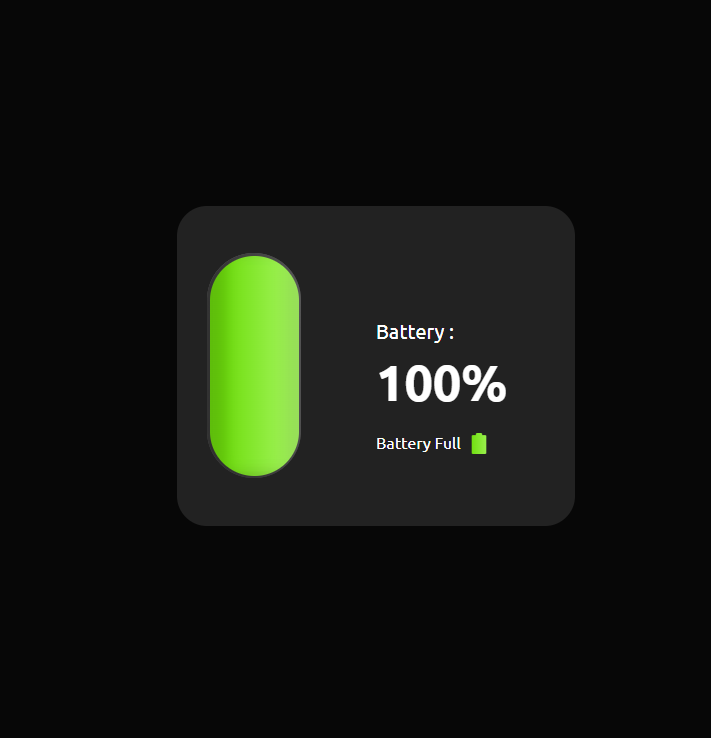

# Day 05 - Detect Device Battery

This project is part of the "100 Days of JavaScript" challenge. On Day 05, we focus on detecting the device's battery status using JavaScript.

## Features

- Detect battery level
- Monitor battery charging status
- Display battery information to the user

## Technologies Used

- HTML
- CSS
- JavaScript

## Getting Started

To get a local copy up and running, follow these simple steps:

### Prerequisites

- Web browser (Chrome, Firefox, etc.)

### Installation

1. Clone the repo
   ```sh
   git clone https://github.com/yourusername/100-days-of-javascript.git
   ```
2. Navigate to the project directory
   ```sh
   cd 100-days-of-javascript/Day\ 05\ -\ Detect\ Device\ Battery
   ```
3. Open `index.html` in your web browser

## Usage

Once you open the `index.html` file in your browser, the page will display the current battery level and charging status of your device.

## Project Structure

```
Day 05 - Detect Device Battery/
├── index.html
├── styles.css
└── script.js
```

## Screenshot


