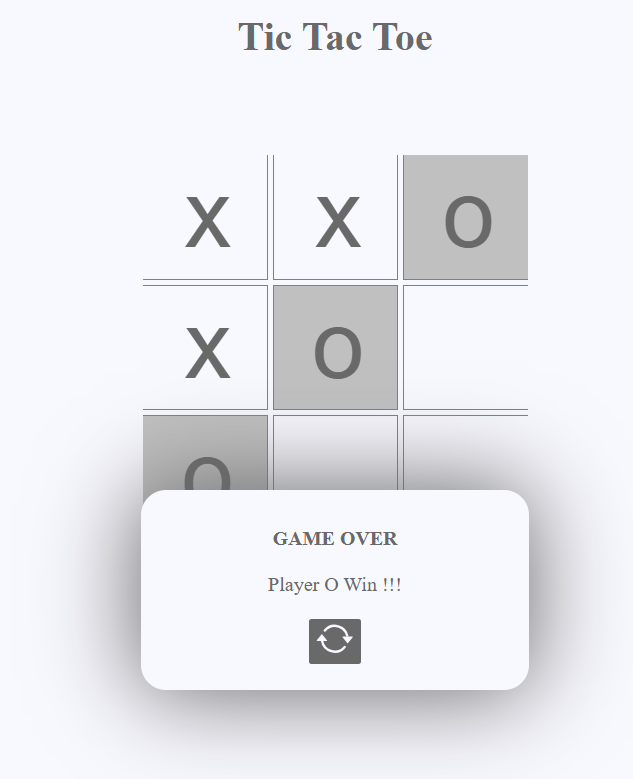

# Day 06 - Tic Tac Toe

## Project Overview
This project is part of the "100 Days of JavaScript" challenge. On Day 06, we will be building a simple Tic Tac Toe game using HTML, CSS, and JavaScript.

## Features
- Two-player game (X and O)
- Interactive game board
- Win detection for rows, columns, and diagonals
- Reset button to start a new game

## Technologies Used
- HTML
- CSS
- JavaScript

## How to Play
1. Open the `index.html` file in your web browser.
2. Player X starts the game by clicking on an empty cell.
3. Players take turns clicking on empty cells to place their marks (X or O).
4. The game will automatically detect a win or a draw and display the result.
5. Click the reset button to start a new game.

## Project Structure
```
/Day 06 - Tic Tac Toe
│
├── index.html
├── style.css
└── script.js
```

## Acknowledgements
This project is inspired by the "100 Days of JavaScript" challenge.

## Screenshot

