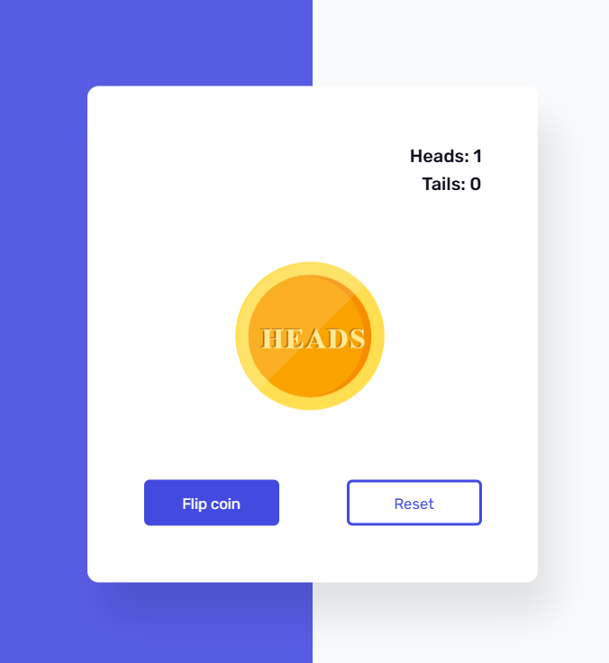

# Toss Game

Welcome to the Toss Game project! This is a simple game built with JavaScript as part of the "100 Days of JavaScript" challenge.

## Project Structure

- `index.html`: The main HTML file that contains the structure of the game.
- `style.css`: The CSS file for styling the game.
- `script.js`: The JavaScript file that contains the game logic.

## How to Play

1. Open the `index.html` file in your web browser.
2. Click the "Toss" button to toss the coin.
3. The result of the toss (Heads or Tails) will be displayed on the screen.

## Features

- Simple and intuitive user interface.
- Randomized coin toss results.
- Responsive design for various screen sizes.

## Technologies Used

- HTML
- CSS
- JavaScript

## Installation

1. Clone the repository:
    ```bash
    git clone https://github.com/yourusername/100-days-of-javascript.git
    ```
2. Navigate to the project directory:
    ```bash
    cd 100-days-of-javascript/Day\ 07\ -\ Toss\ Game
    ```
3. Open `index.html` in your preferred web browser.


## Acknowledgements

- Inspired by the "100 Days of JavaScript" challenge.

Enjoy the game and happy coding!

## Screenshot

